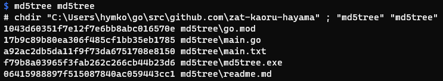

md5tree
=======

Output md5sum of the files under the specified directory.



Install
-------

Download the zipfile from [Releases](https://github.com/zat-kaoru-hayama/md5tree/releases) and unzip.

If you have [scoop-installer](https://scoop.sh),
```
scoop install https://raw.githubusercontent.com/zat-kaoru-hayama/md5tree/master/md5tree.json
```
OR
```
scoop bucket add hymkor https://github.com/hymkor/scoop-bucket
scoop install md5tree
```

Author
-------

HAYAMA Kaoru
